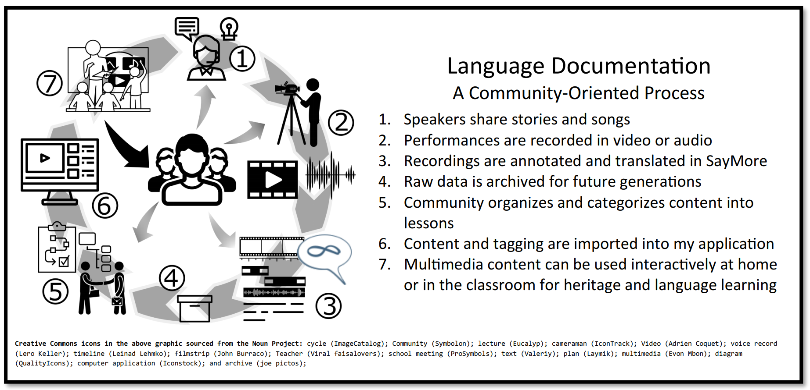

# Prestige

## Full Paper Below
[Prestige- Mobilizing a Bold Corpus](https://mattgyverlee.github.io/docs/Matthew%20Lee%20Defense%20Copy.pdf)

## A distributed application for the community and researchers to interact with media recordings with audio and text annotation layers.

You may already be familiar with SIL International’s Language Technology tools and practices that are designed to be user-friendly and accessible to both external researchers and community members. In addition
to tools and processes for dictionary development (Rapid Word Collection) and literacy (Bloom and Bloomlibrary.com), **SIL International has branched into another domain, Language Documentation. Language Documentation seeks to record, annotate, and preserve stories, songs, local knowledge, and by extension, the
language itself, for current and future generations (see diagram below)**



Once a community has decided what they want to collect, an existing tool called SayMore can guide the users
through steps 1-4, recording, description, annotation and translation of audio and video files into an archiveready format. This tool uses the innovative technique of oral annotation (BOLD, see next page) to avoid the
bottleneck of slow and tedious text transcription of all content.
I am currently researching ways of using that communities can use and learn from the wealth of data in a BOLD
corpus. My Master’s thesis project is to design and create a web application for steps 5-7, organizing, presenting and interacting with a Basic Oral Language Documentation corpus with the hope that it can be used
for literacy, language learning, and heritage education. The following pages are intended to give an overview
of the project and how it may be of interest for your community.

## About the Developers:

My name is Matthew Lee, I am a Language Technology Consultant with SIL
International. Over the past 10 years, I have served through Language Software training to
support translators, linguists, professors, students and community members as they seek to
promote and develop their native languages. Most of this time has been spent working with
communities in French-speaking African communities as I have been based at SIL Cameroon,
but I am currently finishing my Master’s in Descriptive Linguistics at Dallas International University in Dallas, TX.

Blaine Billings is a student at the University of Charleston who completed an internship with Dallas International University. He was an intrumental part of coding and prototyping Prestige.

## Technical Content:

This project was bootstrapped with [Create React App](https://github.com/facebook/create-react-app) and [craco](https://github.com/wwlib/cra-craco-electron-example) which enables file access using create-react-app. `Create-react-app` will manage dependency updates and web packaging. Then [Redux](https://www.npmjs.com/package/redux) was added. Then the scripts were upated to allow debugging and file access.

### Release Version 0.3
https://github.com/MattGyverLee/prestige/releases

Known Issues:

-Loop and fullscreen buttons not implemented.
-Recreates merged media files even if existing (ineffecient)
-There is some oddness in the interface (sizing and scrolling) if the window is less than 720px tall.

### Developer Setup

#### Getting Started

The `yarn` command will install the dependencies.

#### Electron Debugging (from vscode)

1. From the Chrome browser, install the [react devtools plugin](https://chrome.google.com/webstore/detail/react-developer-tools) and the [redux devtools plugin](https://chrome.google.com/webstore/detail/redux-devtools).

2. Use the command:
   `yarn electron-dev`
   to force the install of react and redux devtools into electron.

3. From the debugging tab in VsCode, select `Electron All` from the drop down and press the play button. The page will hot-reload if you make edits.

Subsequently, you can press `F5` to launch Electron with the Chromium browser. If breakpoints are disappearing, check that the debug chooser is still set to `Electron All`.

#### Launching the Web version

`yarn web-dev` runs the app in the development mode.<br>
It opens [http://localhost:3000](http://localhost:3000) in the default browser.

You will have access to two new tabs in the Dev tools, React and Redux inspectors. Local file access is disabled in this web version. Web safe file access can still be used. Any code that is not web safe should be wrapped in a condition as is done in [testFs.tsx](https://github.com/sillsdev/electron-craco-redux-ts/blob/943f8e466a56ef9151cb8ac048078991a5121003/src/model/testFs.tsx#L2)

The page will reload if you make edits.<br>
You will also see any lint errors in the console.

#### Testing

`yarn test` Launches the test runner in the interactive watch mode. There is a single test but it is recommended to use [@testing-library/react](https://www.npmjs.com/package/@testing-library/react)<br>
See the section about [running tests](https://facebook.github.io/create-react-app/docs/running-tests) for more information.

#### Build Electron App

```
yarn electron-pack
yarn dist
```

Builds the app for production to the `build` folder. Then it is compiled into `dist` folder. Currently only tested for Windows. An unpacked `.exe` version is available in `dist/win-unpacked`<br>
It correctly bundles React in production mode and optimizes the build for the best performance.

The build is minified and the filenames include the hashes.<br>
Your app is ready to be deployed!

See the section about [deployment](https://facebook.github.io/create-react-app/docs/deployment) for more information.

#### `yarn eject`

**Note: this is a one-way operation. Once you `eject`, you can’t go back!**

[Ejecting](https://facebook.github.io/create-react-app/docs/available-scripts#npm-run-eject) is not recommended but read the discussion at the link if you are considering it.

### Preparing for production

Warning messages concerning security issues are disabled for development builds in the [electron-dev.js](https://github.com/sillsdev/electron-craco-redux-ts/blob/943f8e466a56ef9151cb8ac048078991a5121003/public/electron-dev.js#L9) and [electron-debug.js](https://github.com/sillsdev/electron-craco-redux-ts/blob/943f8e466a56ef9151cb8ac048078991a5121003/public/electron-debug.js#L9) files on line 9. As you prepare for production, it is recommended to enable these warnings and make any necessary changes to address the [issues](https://github.com/electron/electron/blob/master/docs/tutorial/security.md#electron-security-warnings) they are highlighting.

### Learn More

You can learn more in the [Create React App documentation](https://facebook.github.io/create-react-app/docs/getting-started).

To learn React, check out the [React documentation](https://reactjs.org/).

Webpack installed with:
https://www.codementor.io/randyfindley/how-to-build-an-electron-app-using-create-react-app-and-electron-builder-ss1k0sfer


### Tests to write

- It Loads Blank (Electron 5)
- It Loads French Folder
- Player
   - Loads all 3 Wavesurfers
   - Plays vid and WS0
   - Pauses
   - Plays
   - Seeks
- WS0
   - Seek on WS0
   - Play to End
- WS1
   - Enable WS1
   
   
###Main Process

Load
Click Load
LoadLocal 
@391 Folder Update
@401 Folder Update
@415 onnewfolder
417 start Chokidar
420 ReadyPlayURL = ""
@577 LoadFileWS 


    
