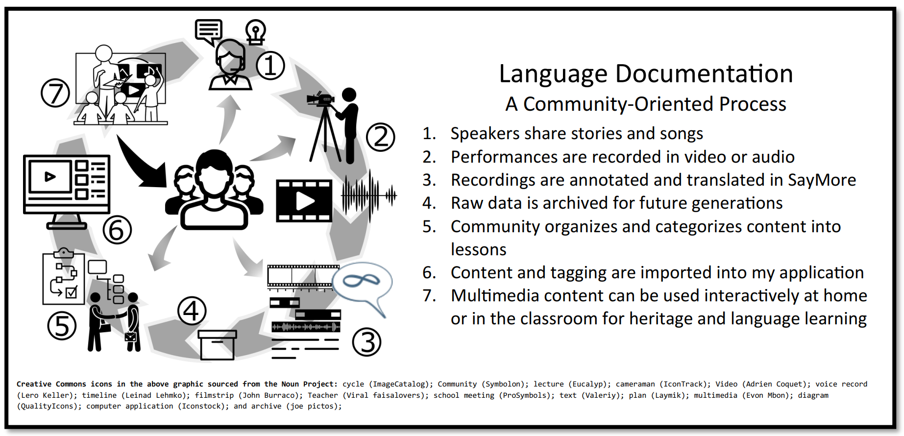

# Prestige

Prestige is a community-facing application for exploring Basic Oral Language Documentation (BOLD) corpora. It lets you load a folder produced by SayMore, browse the source media, view synchronized oral annotations, and play everything back with linked waveforms.

### 🌐 **NEW: Progressive Web App (PWA) Support!**

Prestige now runs as both a desktop application and a Progressive Web App:
- ✅ **Desktop App**: Full functionality including video export (researchers/power users)
- ✅ **PWA**: View and playback in browser - no installation needed (lightweight viewing)

**PWA Use Case**: Share BOLD corpus sessions with community members or collaborators who have desktop/laptop computers but don't need the full desktop app. Perfect for viewing-only scenarios where installing software is inconvenient.

**Note**: Since SayMore (corpus creation) is Windows-only, sessions are typically on desktop computers. The PWA works on desktop browsers (Chrome, Edge, Safari) for easy sharing without installation.

📖 **[PWA User Guide](./PWA_GUIDE.md)** | 🚀 **Try PWA** (see developer guide)

---

[Read the full background paper – *Prestige: Mobilizing a Bold Corpus*](https://mattgyverlee.github.io/docs/Matthew%20Lee%20Defense%20Copy.pdf)

## Who Prestige Serves

- Community heritage and literacy teams that are building a BOLD corpus and want a simple player for sharing stories, songs, and oral histories.
- Researchers looking for a lightweight way to demonstrate annotations to collaborators without installing development tooling.
- Educators who need an offline, synchronized audio/text experience to teach language and cultural content.

## Key Capabilities

- Load any SayMore session folder (`Documents/SayMore/<Project>/Sessions/<SessionName>`) containing videos, audio tracks, and `.eaf` annotations.
- View a synchronized player area that combines the source video, up to three WaveSurfer timelines, and transport controls for looping, jogging, and scrubbing.
- Inspect the DeeJay panel to mix/solo timelines, jump to milestones, and inspect merged translation tracks.
- Read and filter annotations in the table view while browsing the associated files in the File List.
- Automatically notice file changes—Prestige watches the selected folder and refreshes media and `.eaf` metadata when you update the session in SayMore.
- Works completely offline once the app is installed; all data stays on your device.

## System Requirements

- **Operating system:** Windows 10/11 64-bit (current builds are verified on Windows; macOS/Linux packages are experimental).
- **Disk space:** ~1 GB free for the app plus enough room for local media.
- **Data:** A SayMore-generated BOLD corpus (audio/video + `.eaf` annotation files). Keep media and annotations together in the same session folder.

## Download & Install

1. Visit the [Prestige releases](https://github.com/MattGyverLee/prestige/releases) page and download the latest `Prestige Setup <version>.exe`.
2. Double-click the installer and follow the prompts. The default location is in your user `AppData\Local\Programs` folder.
3. Launch Prestige from the Start Menu or by opening `Prestige.exe` in `dist/win-unpacked` if you prefer the portable build.

> Windows Smartscreen may display a warning because Prestige is not code-signed. Choose **More info → Run anyway** to continue.

## Prepare Your Corpus

1. In SayMore, finish collecting and annotating your session (Steps 1–4 in the BOLD workflow).
2. Ensure each session folder contains:
   - Source video (`*.mp4`) and primary audio (`*_Source_01_*.wav` or `.mp3`).
   - Optional translation or oral transcription tracks stored in the `_Annotations` subfolder.
   - ELAN `.eaf` files that reference the media above.
3. Keep the SayMore-generated filenames intact—Prestige links media and annotations by their shared base name.
4. Copy the entire session folder to the machine that will run Prestige (USB drive, network share, etc.).

## First Run

1. Launch Prestige.
2. Select **Select Folder** in the footer and browse to the SayMore session folder (the folder containing your `.eaf` file).
3. Prestige indexes the files, builds waveform previews, and displays:
   - **Player** – video preview + timeline scrubbing.
   - **DeeJay** – multi-track waveform strips for oral annotations, translation layers, and milestones.
   - **Annotation Table** – transcript segments tied to timestamps.
   - **File List** – quick access to all source and derived files in the session.

Subsequent edits you make in SayMore are reflected automatically; the watcher reprocesses new or updated files without restarting the app.

### Navigating the Interface

- Use the standard playback controls (Play/Pause, Seek, Loop) under the main video. Keyboard shortcuts follow Electron defaults (space to toggle playback).
- Click directly inside any WaveSurfer timeline to jump to a precise time, or drag to create selection loops.
- Solo/mute buttons in the DeeJay panel let you focus on oral translations or source audio.
- Double-click a row in the annotation table to jump to that segment in the player.
- The File List highlights missing assets so you can fix mismatches in SayMore before sharing with others.

## Known Issues & Limitations

- Loop and fullscreen buttons are still under construction.
- Exported merged media is regenerated even when the destination file already exists; avoid running the export repeatedly on very large corpora.
- The UI is optimized for displays ≥ 1280×800. Windows shorter than ~720 px may require scrolling and occasionally misplace controls.

## Need Help?

- Browse the in-depth thesis paper linked above for background on the BOLD workflow.
- File issues or feature requests on the [GitHub tracker](https://github.com/MattGyverLee/prestige/issues).
- Email Matthew Lee (`langtech_cameroon@sil.org`) for partnership conversations.

## For Developers

If you plan to modify Prestige or build custom distributions, read the dedicated [Developer Guide](./dev/readme.md) for setup, testing, and packaging instructions.
